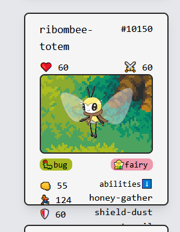

# Pokemon

### TODO

`🚩 prioridade`

#### Design 🎨

- [x] design do card
- [ ] componentes da bola fixed na página
- [ ] componente de bola do tamanho da tela atual
- [ ] fundo definido pelo tipo de pokemon
- [ ] modal com mais informações
- [ ] sobressair o filtro que está sendo utilizado dentre as opções
- [x] adicionar seleção de filtro abaixo da search bar

#### Refact 🧶

- [x] refatorar estado do resultado de pesquisa para um contexto pra ser atualizado em todas as pesquisas

#### Feature 🆕

- [x] chamada com paginação
- [x] endpoints api com filtro
- [x] card com informações da api
- [x] ferramenta de pesquisa
- [x] deixar seleção de filtro abaixo da search bar funcional

### Bug 🚨

- [x] diagnosticar e resolver (acredito que seja o caso de uma otimização na requisição (ou na vdd um bug fix pq foi feita muito porcamente na primeira vez)) problema de requisições multiplas, trazendo resultados duplicados e fora de ordem (bagunça total)
  - Solução: diversas requisições em componentes diferentes sendo chamados na mesma página, causando uma grande bagunça no display (tenebroso !!!!). Foi feito um mapper que mapeia (🙄) uma lista de pokemon e faz uma requisição para os dados de cada um, e retorna essa estrutura 'modelada' e também foi adicionado um contexto, sendo assim tem mais concisão de dados e menos requisições desnecessárias.
- [x] filtro de tipos de pokemon precisa de responsividade
- [ ] overflow de conteúdo do card
      
